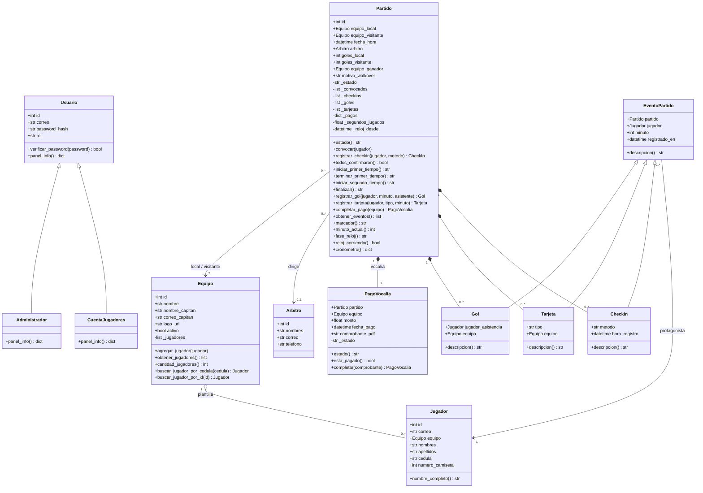
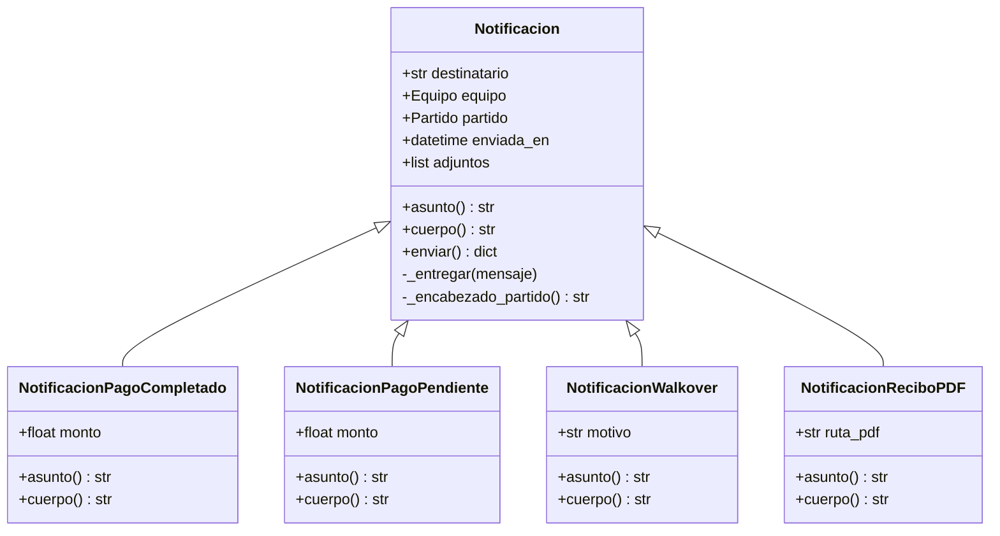
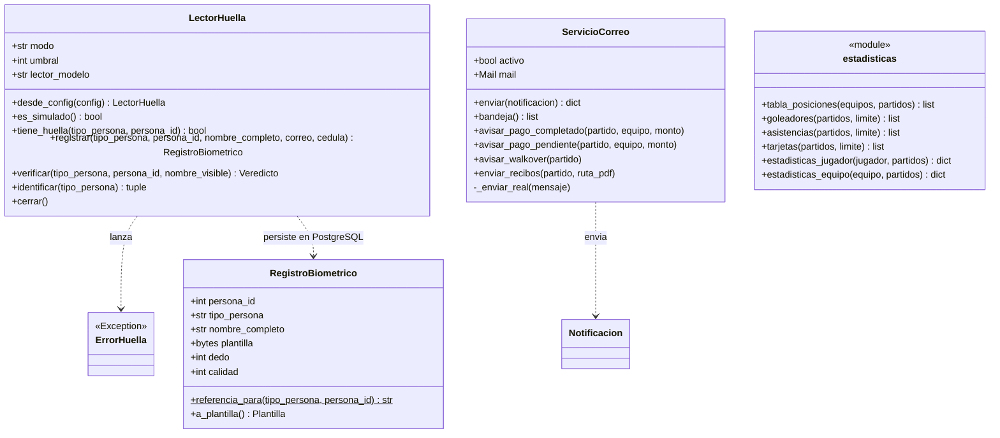
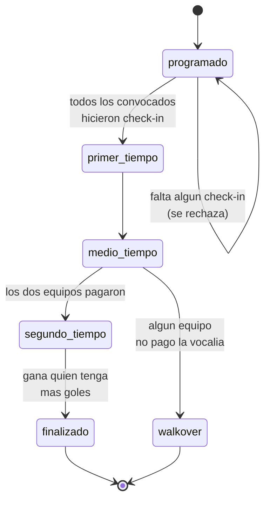

# Diagrama de clases — GolStats

Modelo orientado a objetos del sistema de vocalías. Los diagramas están en
Mermaid, así que GitHub los renderiza solo al abrir este archivo.

Convención de visibilidad: `+` público, `-` privado (en Python, atributos que
empiezan con guion bajo y solo se tocan desde métodos de la propia clase).

---

## 1. Dominio principal

**Cómo leer los rombos.** El rombo relleno (`*--`) es composición: los goles,
tarjetas, check-ins y pagos no existen fuera de su partido, y si el partido
desaparece se van con él. El rombo vacío (`o--`) es agregación: los jugadores
pertenecen a un equipo, pero siguen existiendo como personas aunque el equipo
se desarme.

---

## 2. Jerarquía de notificaciones

Los cuatro correos que manda el sistema comparten destinatario y forma de envío,
y solo se diferencian en qué dicen. Por eso la clase base resuelve `enviar()` una
sola vez y cada subclase define únicamente `asunto()` y `cuerpo()`.

---

## 3. Capa de servicios

Las clases del paquete `servicios/` no son entidades del negocio: son
herramientas que operan sobre las entidades. Se separaron del paquete `modelos/`
justamente para que el dominio no dependa de detalles técnicos como el lector de
huella o el servidor de correo.

`LectorHuella` es la fachada del subsistema biométrico: internamente usa el
paquete `biometria` (ctypes + `sgfplib.dll`) para hablar directo con el lector
SecuGen desde el propio proceso de Flask — ya no hace falta un servicio de
navegador aparte en `https://localhost:8000`. Cada `registrar()` exitoso deja
una fila en la tabla `registros_biometricos` (Postgres), identificada por
`(tipo_persona, persona_id)`; por eso la base de datos biométrica se va
construyendo sola a medida que se enrola a cada jugador, árbitro o
administrador, sin esperar a que el resto del esquema (equipos, partidos)
esté conectado.

---

## 4. Estados del partido

El ciclo de vida de un partido no es libre: cada transición tiene una condición
que se valida antes de dejar pasar. Estas mismas reglas están replicadas como
triggers en PostgreSQL.

Un partido en `walkover` se cierra con marcador 3-0 a favor del equipo que sí
pagó. Si ninguno de los dos pagó, se cierra sin ganador.

---

## 5. Decisiones de diseño

### Por qué `Jugador` ya no hereda de `Usuario`

Al principio un jugador **era** un usuario: cada uno entraba con su correo y su
contraseña a ver sus propias estadísticas, y la herencia evitaba mantener dos
objetos sincronizados para una sola persona.

Eso cambió cuando se pasó a **una sola cuenta compartida** para todos los
jugadores. Lo que un jugador consulta —partidos, posiciones y estadísticas de
cualquier jugador— es información pública del torneo, igual para todos: una
cuenta por persona obligaba a crear, repartir y resetear decenas de contraseñas
sin proteger ningún dato privado.

Con esa decisión, *usuario* y *jugador* dejaron de ser la misma cosa:

- `CuentaJugadores` es la cuenta: hereda de `Usuario`, tiene credenciales y es
  anónima (no tiene equipo ni camiseta, porque no representa a nadie en
  concreto).
- `Jugador` es la persona: una entidad del dominio, sujeto de estadísticas, sin
  credenciales. Su `correo` quedó como dato de contacto, no como login.

`Administrador` y `CuentaJugadores` redefinen `panel_info()`: la ruta `/panel`
llama al mismo método sin preguntar el rol, y cada clase responde con lo suyo.
Eso es polimorfismo resolviendo un `if` que si no habría que repetir en cada
vista.

### Por qué el cronómetro vive en `Partido` y no en el navegador

El reloj del partido no guarda "el minuto" como un número que alguien
incrementa: guarda los segundos ya acumulados (`_segundos_jugados`) más el
instante en que arrancó el tramo actual (`_reloj_desde`). El minuto se calcula
al consultarlo.

Eso lo hace inmune a los problemas del enfoque obvio (un contador en
JavaScript): el tiempo sigue corriendo aunque nadie tenga la vocalía abierta,
recargar la página no lo reinicia, y dos pantallas mirando el mismo partido no
pueden mostrar minutos distintos. El navegador solo pinta el número y cada
10 segundos se resincroniza contra `/partidos/<id>/cronometro`.

Quien manda es el administrador, no un temporizador automático: el reloj
arranca, se pausa y se reanuda enganchado a las transiciones de estado que él
dispara (`iniciar_primer_tiempo`, `terminar_primer_tiempo`,
`iniciar_segundo_tiempo`). Por eso el medio tiempo no dura un tiempo fijo: dura
lo que el admin decida, y no suma minutos al partido.

### Por qué existe `EventoPartido`

Goles, tarjetas y check-ins comparten estructura: los tres ocurren en un partido,
los protagoniza un jugador, tienen un momento y se pueden describir en texto.
La clase base recoge eso y cada subclase define su `descripcion()`. Gracias a
eso, `obtener_eventos()` puede juntar goles y tarjetas en una sola lista
ordenada y la plantilla los recorre sin preguntar de qué tipo es cada uno.

### Qué se encapsuló y por qué

| Atributo | Por qué es privado |
|---|---|
| `Equipo._jugadores` | `agregar_jugador()` valida que el número de camiseta no esté repetido. Si la lista fuera pública, cualquiera podría meter un duplicado con `.append()`. |
| `Partido._estado` | Solo cambia por los métodos de transición, que verifican check-ins y pagos antes de dejar avanzar. Asignarlo a mano saltearía todas las reglas del negocio. |
| `PagoVocalia._estado` | Marcar un pago exige registrar también la fecha. `completar()` hace las dos cosas juntas; un atributo público permitiría dejar el pago en un estado incoherente. |
| `Partido._goles` y `_tarjetas` | `registrar_gol()` actualiza el marcador en el mismo paso. Agregar un gol por fuera dejaría el marcador desactualizado. |

Los métodos `obtener_*()` devuelven **copias** de las listas internas
(`list(self._jugadores)`), no la lista real. Así, si alguien modifica lo que
recibe, no está tocando el estado interno del objeto sin querer.
