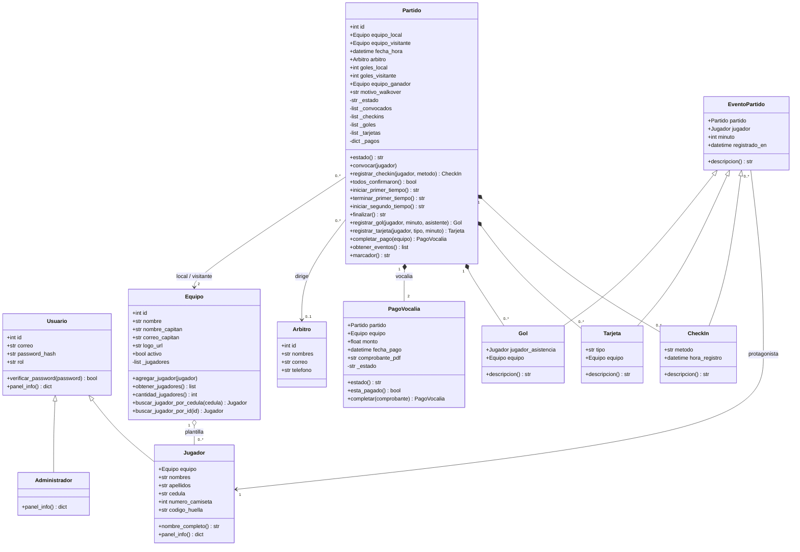
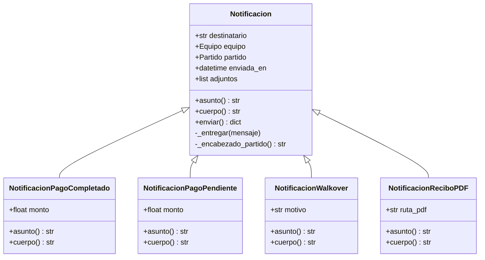
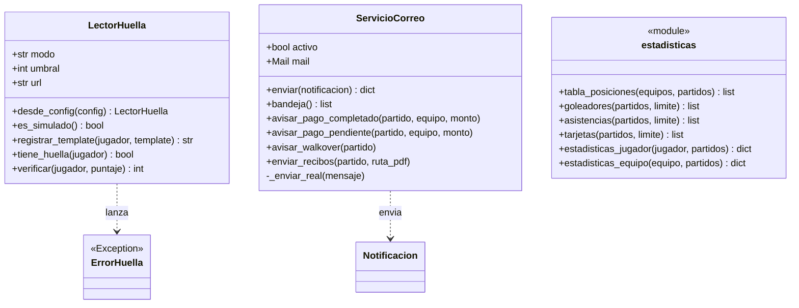
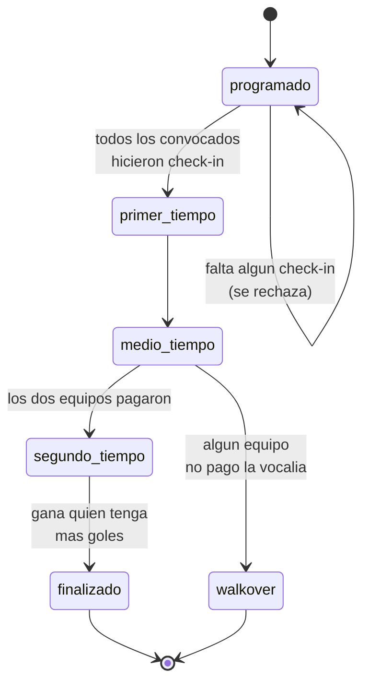

# Diagrama de clases — GolStats

Modelo orientado a objetos del sistema de vocalías. Los diagramas están en
Mermaid, así que GitHub los renderiza solo al abrir este archivo.

Convención de visibilidad: `+` público, `-` privado (en Python, atributos que
empiezan con guion bajo y solo se tocan desde métodos de la propia clase).

---

## 1. Dominio principal

**Cómo leer los rombos.** El rombo relleno (`*--`) es composición: los goles,
tarjetas, check-ins y pagos no existen fuera de su partido, y si el partido
desaparece se van con él. El rombo vacío (`o--`) es agregación: los jugadores
pertenecen a un equipo, pero siguen existiendo como personas aunque el equipo
se desarme.

---

## 2. Jerarquía de notificaciones

Los cuatro correos que manda el sistema comparten destinatario y forma de envío,
y solo se diferencian en qué dicen. Por eso la clase base resuelve `enviar()` una
sola vez y cada subclase define únicamente `asunto()` y `cuerpo()`.

---

## 3. Capa de servicios

Las clases del paquete `servicios/` no son entidades del negocio: son
herramientas que operan sobre las entidades. Se separaron del paquete `modelos/`
justamente para que el dominio no dependa de detalles técnicos como el lector de
huella o el servidor de correo.

---

## 4. Estados del partido

El ciclo de vida de un partido no es libre: cada transición tiene una condición
que se valida antes de dejar pasar. Estas mismas reglas están replicadas como
triggers en PostgreSQL.

Un partido en `walkover` se cierra con marcador 3-0 a favor del equipo que sí
pagó. Si ninguno de los dos pagó, se cierra sin ganador.

---

## 5. Decisiones de diseño

### Por qué `Jugador` hereda de `Usuario`

En este sistema un jugador **es** un usuario: entra con correo y contraseña a ver
sus estadísticas. Modelarlo como una clase aparte con un campo `usuario_id`
habría obligado a mantener dos objetos sincronizados para representar a una sola
persona. La herencia refleja mejor la realidad y evita ese problema.

`Administrador` y `Jugador` redefinen `panel_info()`: la ruta `/panel` llama al
mismo método sin preguntar el rol, y cada clase responde con lo suyo. Eso es
polimorfismo resolviendo un `if` que si no habría que repetir en cada vista.

### Por qué existe `EventoPartido`

Goles, tarjetas y check-ins comparten estructura: los tres ocurren en un partido,
los protagoniza un jugador, tienen un momento y se pueden describir en texto.
La clase base recoge eso y cada subclase define su `descripcion()`. Gracias a
eso, `obtener_eventos()` puede juntar goles y tarjetas en una sola lista
ordenada y la plantilla los recorre sin preguntar de qué tipo es cada uno.

### Qué se encapsuló y por qué

| Atributo | Por qué es privado |
|---|---|
| `Equipo._jugadores` | `agregar_jugador()` valida que el número de camiseta no esté repetido. Si la lista fuera pública, cualquiera podría meter un duplicado con `.append()`. |
| `Partido._estado` | Solo cambia por los métodos de transición, que verifican check-ins y pagos antes de dejar avanzar. Asignarlo a mano saltearía todas las reglas del negocio. |
| `PagoVocalia._estado` | Marcar un pago exige registrar también la fecha. `completar()` hace las dos cosas juntas; un atributo público permitiría dejar el pago en un estado incoherente. |
| `Partido._goles` y `_tarjetas` | `registrar_gol()` actualiza el marcador en el mismo paso. Agregar un gol por fuera dejaría el marcador desactualizado. |

Los métodos `obtener_*()` devuelven **copias** de las listas internas
(`list(self._jugadores)`), no la lista real. Así, si alguien modifica lo que
recibe, no está tocando el estado interno del objeto sin querer.
