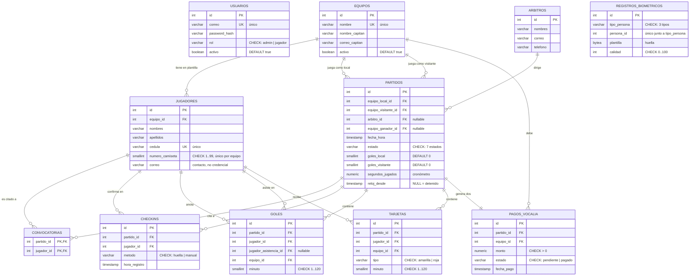

# Modelo de datos — GolStats

Diagrama entidad-relación y diseño relacional de la base de datos.
El esquema ejecutable está en [`database/`](../database/).

Complementa a [`diagrama-clases.md`](diagrama-clases.md): aquel describe las
clases de Python, este las tablas de PostgreSQL. Se parecen, pero no son lo
mismo — las diferencias están explicadas al final.

---

## 1. Diagrama entidad-relación



**`USUARIOS` no se relaciona con nadie**, y no es un olvido. Desde que existe
la cuenta única compartida, un jugador **no es** un usuario: hay exactamente
dos filas en esa tabla —el administrador y la cuenta de jugadores— y ninguna
apunta a una persona concreta. Ver la decisión de diseño en
[`diagrama-clases.md`](diagrama-clases.md#por-qué-jugador-ya-no-hereda-de-usuario).

**`REGISTROS_BIOMETRICOS` tampoco tiene claves foráneas.** Se enlaza por el par
`(tipo_persona, persona_id)`, que apunta a tres tablas distintas según el
valor. Es una relación polimórfica: la base no puede garantizarla con una FK,
y a cambio permite enrolar jugadores, árbitros y administradores en una sola
tabla. Es la única concesión del esquema, y está aquí porque esa tabla ya
existía en producción antes que el resto.

---

## 2. Diseño relacional

Notación: **PK** subrayada conceptualmente, *FK* en cursiva.

| Tabla | Atributos |
|---|---|
| `usuarios` | **id**, correo, password_hash, rol, activo, creado_en |
| `equipos` | **id**, nombre, nombre_capitan, correo_capitan, logo_url, activo, creado_en |
| `jugadores` | **id**, *equipo_id*, nombres, apellidos, cedula, numero_camiseta, correo, activo, creado_en |
| `arbitros` | **id**, nombres, correo, telefono, activo |
| `partidos` | **id**, *equipo_local_id*, *equipo_visitante_id*, *arbitro_id*, *equipo_ganador_id*, fecha_hora, estado, goles_local, goles_visitante, motivo_walkover, motivo_cancelacion, segundos_jugados, reloj_desde, creado_en |
| `convocatorias` | **(*partido_id*, *jugador_id*)**, creado_en |
| `checkins` | **id**, *partido_id*, *jugador_id*, metodo, hora_registro |
| `goles` | **id**, *partido_id*, *jugador_id*, *jugador_asistencia_id*, *equipo_id*, minuto, registrado_en |
| `tarjetas` | **id**, *partido_id*, *jugador_id*, *equipo_id*, tipo, minuto, registrado_en |
| `pagos_vocalia` | **id**, *partido_id*, *equipo_id*, monto, estado, fecha_pago, comprobante_pdf |
| `registros_biometricos` | **id**, tipo_persona, persona_id, nombre_completo, correo, cedula, dedo, formato, plantilla, calidad, muestras_usadas, proveedor, registrado_en, actualizado_en |

### Cardinalidades

| Relación | Cardinalidad | Nota |
|---|---|---|
| Equipo — Jugador | 1 : N | Un jugador pertenece a un solo equipo |
| Equipo — Partido | 1 : N (dos veces) | Como local y como visitante |
| Árbitro — Partido | 1 : N | Opcional: `arbitro_id` admite NULL |
| Partido — Jugador | **N : M** | Resuelta con `convocatorias` |
| Partido — Pago | 1 : 2 | Exactamente dos, uno por equipo |
| Partido — Gol / Tarjeta | 1 : N | Débiles: no existen sin su partido |

---

## 3. Normalización

El esquema está en **tercera forma normal (3FN)**, con una desnormalización
deliberada que se justifica abajo.

**1FN — valores atómicos.** No hay campos multivaluados. La lista de
convocados, que en el modelo de objetos es un atributo de `Partido`, aquí es
la tabla `convocatorias`.

**2FN — sin dependencias parciales.** La única PK compuesta es
`convocatorias(partido_id, jugador_id)`, y su único atributo no clave
(`creado_en`) depende de las dos columnas juntas.

**3FN — sin dependencias transitivas.** El nombre del equipo vive solo en
`equipos`; `jugadores` guarda el `equipo_id`, no el nombre. Lo mismo con el
árbitro y el capitán.

### Las dos excepciones, y por qué

**`goles.equipo_id` y `tarjetas.equipo_id` son redundantes.** Se pueden
deducir con `jugadores.equipo_id`. Se guardan igual porque el marcador y la
tabla de posiciones son las consultas más frecuentes del sistema, y obligarlas
a un JOIN extra por cada gol no compensa.

El riesgo de toda desnormalización es que los dos valores se separen. Aquí no
puede pasar: **el trigger `fn_validar_gol` sobrescribe `equipo_id` con el
equipo real del jugador en cada INSERT y UPDATE**, así que el valor que se
mande a mano se ignora.

**`partidos.goles_local` y `goles_visitante` son un agregado.** Podrían
contarse desde `goles` cada vez. Se guardan porque el marcador se lee
constantemente, y el trigger `fn_recalcular_marcador` los recalcula enteros
tras cualquier inserción, edición o borrado. No se incrementan: se recuentan,
que es lo que hace imposible que se desincronicen.

---

## 4. Dónde vive cada validación

Las 36 reglas que Python valida hoy, y su equivalente en la base. El criterio
para elegir dónde va cada una:

- **CHECK / UNIQUE / FK** cuando la regla solo mira la fila que se inserta.
- **Trigger** cuando necesita consultar otras filas.
- **Procedimiento** cuando son varios pasos que deben ocurrir juntos.

| Regla de negocio | Dónde vive en la base | Tipo |
|---|---|---|
| Rol válido (`admin`/`jugador`) | `ck_usuarios_rol` | CHECK |
| Correo de usuario único | `uq_usuarios_correo` | UNIQUE |
| Nombre de equipo único | `uq_equipos_nombre` | UNIQUE |
| Cédula única | `uq_jugadores_cedula` | UNIQUE |
| Dorsal entre 1 y 99 | `ck_jugadores_dorsal` | CHECK |
| Dorsal único **por equipo** | `uq_jugadores_dorsal` | UNIQUE compuesto |
| Un equipo no juega contra sí mismo | `ck_partidos_rivales` | CHECK |
| Estado de partido válido | `ck_partidos_estado` | CHECK |
| El ganador es uno de los dos que jugaron | `ck_partidos_ganador` | CHECK |
| Marcador no negativo | `ck_partidos_marcador` | CHECK |
| Cancelado ⇔ tiene motivo | `ck_partidos_cancelacion` | CHECK |
| Minuto entre 1 y 120 | `ck_goles_minuto`, `ck_tarjetas_minuto` | CHECK |
| Nadie se asiste a sí mismo | `ck_goles_autoasistencia` | CHECK |
| Tipo de tarjeta válido | `ck_tarjetas_tipo` | CHECK |
| Método de check-in válido | `ck_checkins_metodo` | CHECK |
| Un check-in por jugador y partido | `uq_checkins` | UNIQUE |
| Monto de vocalía > 0 | `ck_pagos_monto` | CHECK |
| Pagado ⇔ tiene fecha | `ck_pagos_coherencia` | CHECK |
| Un pago por equipo y partido | `uq_pagos` | UNIQUE |
| Tipo de persona y proveedor biométrico | `ck_biometria_*` | CHECK |
| El convocado pertenece a uno de los dos equipos | `trg_validar_convocatoria` | **Trigger** |
| Solo se convoca con el partido programado | `trg_validar_convocatoria` | **Trigger** |
| El check-in exige partido programado y convocatoria | `trg_validar_checkin` | **Trigger** |
| El gol exige partido en juego | `trg_validar_gol` | **Trigger** |
| El goleador hizo check-in | `trg_validar_gol` | **Trigger** |
| La asistencia es de un compañero | `trg_validar_gol` | **Trigger** |
| El minuto del gol ≤ minuto del cronómetro | `trg_validar_gol` + `fn_minuto_actual` | **Trigger** |
| No se registran goles en el medio tiempo | `trg_validar_gol` | **Trigger** |
| El marcador refleja los goles | `trg_recalcular_marcador` | **Trigger** |
| Las tarjetas exigen check-in y partido en juego | `trg_validar_tarjeta` | **Trigger** |
| Transiciones de estado del reglamento | `trg_validar_transicion_partido` | **Trigger** |
| Un partido cerrado no reabre | `trg_validar_transicion_partido` | **Trigger** |
| Cada partido nace con sus dos pagos | `trg_crear_pagos_vocalia` | **Trigger** |
| No se inicia sin todos los check-in | `sp_iniciar_primer_tiempo` | **Procedimiento** |
| Walkover si alguien no pagó al reanudar | `sp_iniciar_segundo_tiempo` | **Procedimiento** |
| El ganador sale del marcador al finalizar | `sp_finalizar_partido` | **Procedimiento** |
| Solo se cancela un partido programado | `sp_cancelar_partido` | **Procedimiento** |
| La vocalía no se cobra dos veces | `sp_completar_pago_vocalia` | **Procedimiento** |

### El cronómetro

`fn_minuto_actual(partido_id)` replica `Partido.minuto_actual()`: calcula el
minuto a partir de `segundos_jugados + (ahora − reloj_desde)`, con el mismo
criterio —corriendo muestra el minuto en curso, en pausa el último cumplido,
tope en 90—. Está centralizada para que la validación de goles y las vistas no
puedan discrepar entre sí.

---

## 5. Vistas

Las cinco que `servicios/estadisticas.py` ya declara en su docstring:

| Vista | Reemplaza a | Devuelve |
|---|---|---|
| `vw_tabla_posiciones` | `tabla_posiciones()` | posición, equipo, PJ, PG, PE, PP, GF, GC, DG, puntos |
| `vw_goleadores` | `goleadores()` | jugador, equipo, goles |
| `vw_asistencias` | `asistencias()` | jugador, equipo, asistencias |
| `vw_tarjetas` | `tarjetas()` | jugador, equipo, amarillas, rojas |
| `vw_estadisticas_jugador` | `estadisticas_jugador()` | PJ, goles, asistencias, amarillas, rojas |

Todas se apoyan en `vw_partidos_disputados`, que filtra por
`estado IN ('finalizado','walkover')`. **Los cancelados quedan fuera**: están
cerrados pero no se jugaron, y contarlos regalaría un empate a 0 a los dos
equipos. Es el mismo criterio que en Python separa `esta_cerrado()` de
`cuenta_para_estadisticas()`.

Un detalle de la tabla de posiciones: un walkover **sin ganador** —cuando
ninguno de los dos pagó— no es un empate. Pierden los dos y nadie suma.

---

## 6. Diferencias con el modelo de objetos

No son un descuido: cada una responde a que una base relacional y un modelo de
objetos resuelven cosas distintas.

| En Python | En PostgreSQL | Por qué |
|---|---|---|
| `Jugador` no hereda de `Usuario` | Tablas sin relación | La cuenta es compartida; no hay a quién apuntar |
| Herencia `EventoPartido → Gol/Tarjeta/CheckIn` | Tres tablas separadas | La herencia de tablas de Postgres complica índices y FK sin dar nada a cambio aquí |
| `_convocados` es una lista | Tabla `convocatorias` | 1FN: no hay atributos multivaluados |
| El marcador se incrementa | Se recalcula por trigger | Recontar no puede desincronizarse |
| `Notificacion` y subclases | *Sin tabla* | Los correos no se persisten; salen y se olvidan |

---

## 7. Cómo montarlo

```bash
psql -U postgres -c "CREATE DATABASE golstats;"
```

```bash
psql -U postgres -d golstats -f database/01_schema.sql
```

Y luego `02_triggers.sql`, `03_procedimientos.sql`, `04_vistas.sql` y
`05_datos_iniciales.sql`, **en ese orden**: los triggers necesitan las tablas,
las vistas necesitan los datos que consultan, y los procedimientos usan ambos.

Los scripts son reejecutables: `01` hace `DROP ... CASCADE` de sus tablas y
`05` usa `ON CONFLICT DO NOTHING`.

> **Aviso:** `01_schema.sql` borra y recrea las diez tablas del torneo. **No
> toca `registros_biometricos`**, que ya está en producción con huellas
> reales: solo le añade los `CHECK` que le faltaban, sin recrearla.
